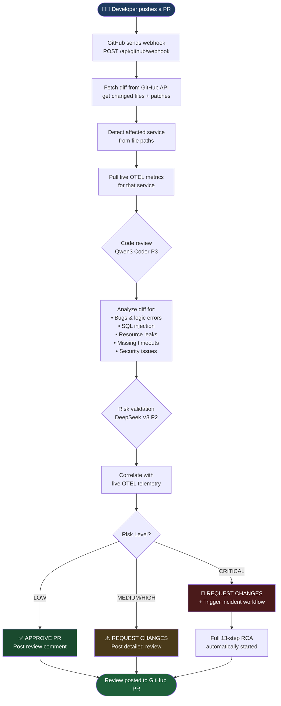
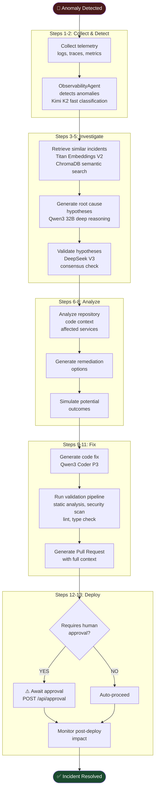
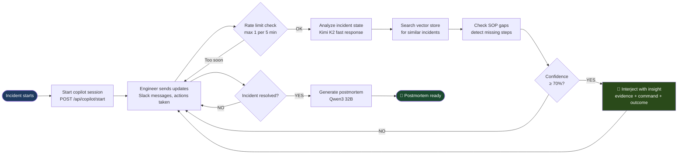
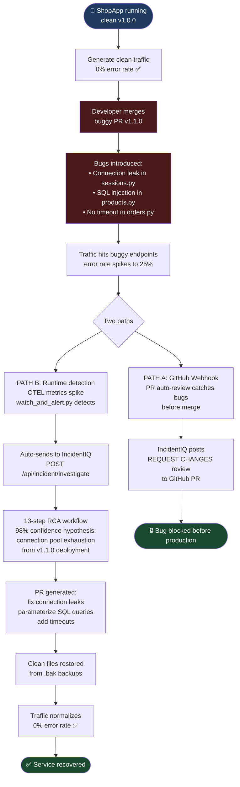
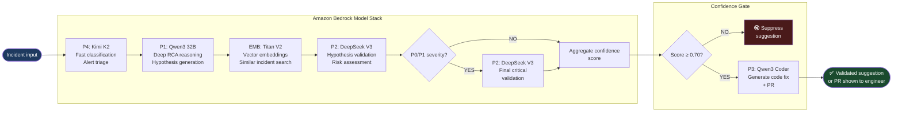
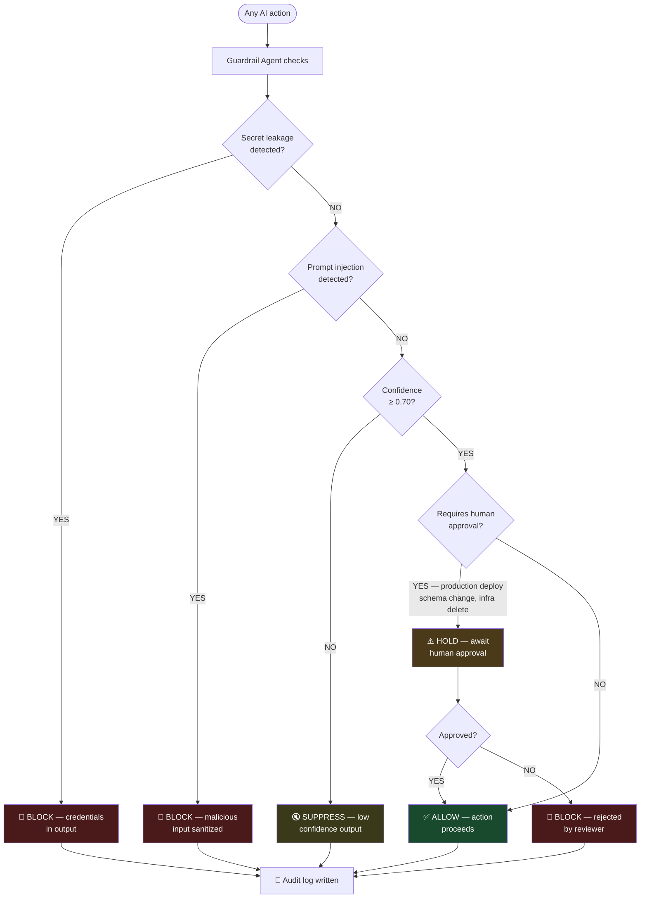

# IncidentIQ
### Real-time AI Co-pilot for Incident Response — Powered by Amazon Bedrock

> **Amazon Bedrock Hackathon 2026** · Reduce MTTR by 44% · Turn 47-minute incidents into 26-minute resolutions

---

## What is IncidentIQ?

IncidentIQ is an autonomous AI engineering platform that watches your code, monitors your services, and acts as a second pair of eyes during incidents. When something breaks — whether from a bad PR, a deployment regression, or a runtime anomaly — IncidentIQ detects it, investigates it, and generates a fix automatically.

---

## System Architecture

```
┌─────────────────────────────────────────────────────────────────────────┐
│                         INCIDENTIQ PLATFORM                              │
│                                                                          │
│  ┌──────────────┐    ┌──────────────┐    ┌──────────────────────────┐  │
│  │  ShopApp UI  │    │ IncidentIQ   │    │   GitHub Repository      │  │
│  │  React :3001 │    │ Dashboard    │    │   pavankumarry/Incident_iq│  │
│  │              │    │ React :3000  │    │                          │  │
│  └──────┬───────┘    └──────┬───────┘    └──────────┬─────────────┘  │
│         │                   │                        │                  │
│         ▼                   ▼                        │ webhook          │
│  ┌──────────────┐    ┌──────────────┐               │                  │
│  │  ShopApp API │    │IncidentIQ API│◄──────────────┘                  │
│  │  FastAPI:8001│    │ FastAPI:8000 │                                   │
│  │  SQLite DB   │    │              │                                   │
│  │  OTEL metrics│───►│  /api/...    │                                   │
│  └──────────────┘    └──────┬───────┘                                   │
│                             │                                            │
│                    ┌────────▼────────┐                                  │
│                    │  LangGraph      │                                   │
│                    │  Orchestrator   │                                   │
│                    │  13-step flow   │                                   │
│                    └────────┬────────┘                                  │
│                             │                                            │
│         ┌───────────────────┼───────────────────┐                       │
│         ▼                   ▼                   ▼                       │
│  ┌─────────────┐   ┌──────────────┐   ┌──────────────┐                │
│  │Observability│   │  RCA Agent   │   │Code Intel.   │                │
│  │   Agent     │   │  Qwen3 32B   │   │   Agent      │                │
│  │  Kimi K2    │   │  DeepSeek V3 │   │ Qwen3 Coder  │                │
│  └─────────────┘   └──────────────┘   └──────────────┘                │
│         │                   │                   │                       │
│         └───────────────────┼───────────────────┘                       │
│                             ▼                                            │
│                    ┌────────────────┐                                   │
│                    │Amazon Bedrock  │                                   │
│                    │P1: Qwen3 32B   │                                   │
│                    │P2: DeepSeek V3 │                                   │
│                    │P3: Qwen3 Coder │                                   │
│                    │P4: Kimi K2     │                                   │
│                    │EMB: Titan V2   │                                   │
│                    └────────┬───────┘                                   │
│                             │                                            │
│                    ┌────────▼───────┐                                   │
│                    │  ChromaDB      │                                   │
│                    │  Vector Store  │                                   │
│                    │  1200+ incident│                                   │
│                    │  embeddings    │                                   │
│                    └────────────────┘                                   │
└─────────────────────────────────────────────────────────────────────────┘
```

---

## Flow 1 — PR Review (GitHub Integration)



---

## Flow 2 — Incident Detection & RCA (13-Step Workflow)



---

## Flow 3 — Live Copilot (Real-time Assistance)



---

## Flow 4 — ShopApp Demo (End-to-End)



---

## Flow 5 — Multi-Model Consensus



---

## Model Priority Stack

| Priority | Model | Role | Tasks |
|----------|-------|------|-------|
| **P1** | `qwen.qwen3-32b-v1:0` | Primary Reasoning | RCA, orchestration, deep analysis |
| **P2** | `deepseek.v3-v1:0` | Deep Analysis | Critical validation, consensus |
| **P3** | `qwen.qwen3-coder-30b-a3b-v1:0` | Code Intelligence | PR generation, code review, fixes |
| **P4** | `moonshotai.kimi-k2.5` | Fast ChatOps | Alert classification, summaries |
| **EMB** | `amazon.titan-embed-text-v2:0` | Embeddings | Vector search, RAG retrieval |

---

## Guardrail System



---

## Quick Start

```powershell
# Terminal 1 — IncidentIQ backend
cd C:\grabhack\incidentiq
$env:PYTHONPATH = "C:\grabhack\incidentiq"
C:\grabhack\venv\Scripts\python.exe -m uvicorn backend.main:app --port 8000 --reload

# Terminal 2 — ShopApp backend
cd C:\grabhack\shopapp\backend
C:\grabhack\venv\Scripts\python.exe -m uvicorn main:app --port 8001 --reload

# Terminal 3 — IncidentIQ dashboard
cd C:\grabhack\incidentiq\frontend
npm run dev   # http://localhost:3000

# Terminal 4 — ShopApp frontend
cd C:\grabhack\shopapp\frontend
npm run dev   # http://localhost:3001

# Run the full end-to-end demo
cd C:\grabhack\shopapp
C:\grabhack\venv\Scripts\python.exe scripts\run_demo.py
```

---

## Services

| Service | URL | Description |
|---------|-----|-------------|
| ShopApp UI | http://localhost:3001 | E-commerce demo app |
| ShopApp API | http://localhost:8001 | FastAPI + SQLite |
| IncidentIQ UI | http://localhost:3000 | AI dashboard |
| IncidentIQ API | http://localhost:8000 | FastAPI multi-agent |
| API Docs | http://localhost:8000/docs | Swagger UI |

---

## Tech Stack

| Layer | Technology |
|-------|-----------|
| AI/LLM | Amazon Bedrock (Qwen3, DeepSeek, Kimi, Titan) |
| Orchestration | LangGraph, LangChain |
| Backend | Python 3.13, FastAPI, WebSockets |
| Vector DB | ChromaDB (dev) / Pinecone (prod) |
| Database | SQLite (dev) / PostgreSQL (prod) |
| Cache | Redis |
| Frontend | React 18, TypeScript, Tailwind CSS, Vite |
| Observability | OpenTelemetry, Prometheus, CloudWatch |
| Containers | Docker, Kubernetes |

---

## Repository Structure

```
Incident_iq/
├── incidentiq/                  # AI Incident Response Platform
│   ├── backend/
│   │   ├── agents/              # 5 specialized AI agents
│   │   │   ├── observability_agent.py
│   │   │   ├── rca_agent.py
│   │   │   ├── code_intelligence_agent.py
│   │   │   ├── incident_copilot_agent.py
│   │   │   └── orchestrator.py
│   │   ├── bedrock/             # Bedrock client + model router
│   │   ├── integrations/        # GitHub webhook + OTEL collector
│   │   ├── memory/              # Vector store + incident seeding
│   │   ├── validators/          # Guardrail agent
│   │   ├── config.py
│   │   └── main.py              # FastAPI app (:8000)
│   ├── frontend/                # React dashboard (:3000)
│   │   └── src/pages/
│   │       ├── Dashboard.tsx    # Live service health
│   │       ├── PRReview.tsx     # GitHub PR analysis
│   │       ├── IncidentInvestigate.tsx
│   │       ├── LiveCopilot.tsx  # Real-time copilot
│   │       └── ReasoningLog.tsx # Audit trail
│   └── scripts/
│       ├── test_bedrock.py      # Verify all 5 models
│       ├── test_pr_review.py    # PR review demo
│       └── run_demo.py          # Full demo
│
└── shopapp/                     # Demo E-commerce Target App
    ├── backend/
    │   ├── routes/              # products, orders, users, sessions
    │   ├── models.py
    │   ├── telemetry.py         # OTEL instrumentation
    │   └── main.py              # FastAPI app (:8001)
    ├── frontend/                # React shop (:3001)
    └── scripts/
        ├── introduce_bug.py     # Inject 3 realistic bugs
        ├── fix_bug.py           # Restore clean files
        ├── notify_incidentiq.py # Send to IncidentIQ manually
        ├── watch_and_alert.py   # Continuous OTEL watcher
        └── run_demo.py          # Full end-to-end demo
```

---

*Built for the Amazon Bedrock Hackathon 2026 — IncidentIQ: Real-time AI co-pilot for incident response.*
